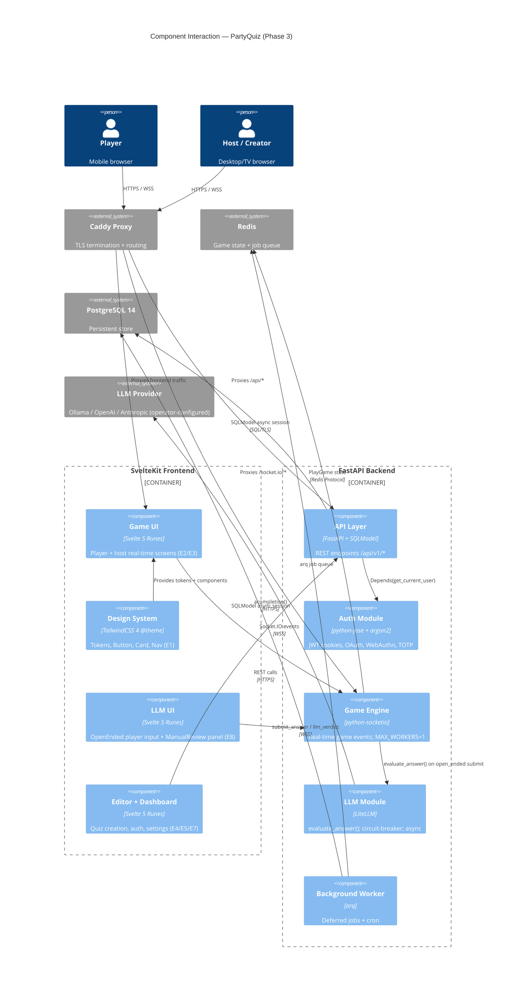
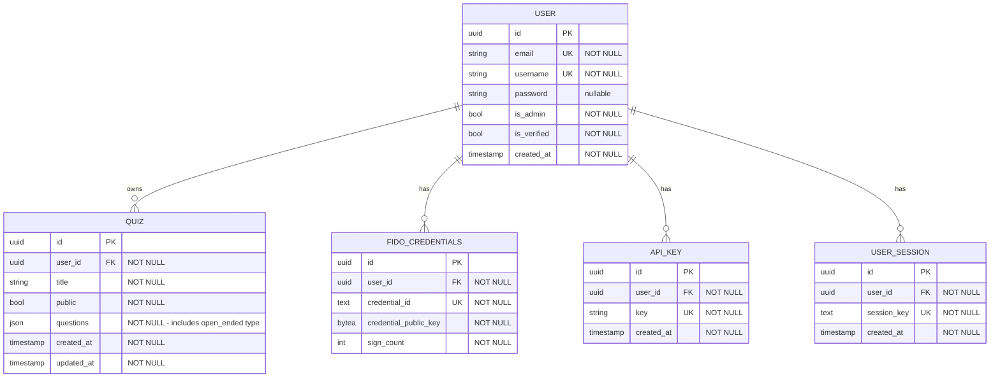

# PartyQuiz — Architecture Document

> **Boundaries (Always / Ask / Never) — read first:**
> - **Always do:** Follow SPDX MPL-2.0 headers, use token names (never hardcoded hex), write tests alongside code, use SQLModel async sessions, gate open-ended answers through `classquiz/llm/` never directly in routers.
> - **Ask first:** Add a new Docker Compose service, change a PostgreSQL column type, modify a Socket.IO event name, add a new LLM provider to the gateway, upgrade a pinned dependency.
> - **Never do:** Hardcode LLM API keys, bypass JWT auth middleware, commit `.env` files, write synchronous blocking I/O in the async event loop, add `MAX_WORKERS` > 1 without implementing Redis socket adapter first.

---

## Technical Overview

PartyQuiz is a brownfield Python/SvelteKit monolith delivering real-time multiplayer quizzes. The system has three deployment processes: a **FastAPI backend** (REST + Socket.IO ASGI-mounted), a **SvelteKit SSR frontend**, and an **arq background worker**. All three share PostgreSQL 14, Redis, MeiliSearch, and pluggable file storage. The redesign PRD adds a "High-Voltage Arcade" visual overhaul across 35 stories plus a new LLM-judged open-ended question type (E8) via LiteLLM.

The two highest-risk architectural changes in this phase are:
1. **ORM replacement** — `ormar` (deprecated) → `SQLModel` (Pydantic-v2 native, actively maintained). Affects all 15+ router files and `classquiz/db/models.py`.
2. **LLM integration** — New `classquiz/llm/` module wrapping LiteLLM. A circuit-breaker pattern guards the live game loop against LLM unavailability.

Risk appetite is **Moderate**: resolve the top technical risks within this phase; leave further refactoring (Rust migration stub, Sentry SDK version split) for a future sprint. Hosting stays Docker Compose self-hosted; monitoring is extended with Prometheus + Grafana.

---

## Existing System Context

| Attribute | Value |
|-----------|-------|
| **Project type** | Brownfield — fork of ClassQuiz (mawoka-myblock), MPL-2.0 |
| **Backend** | Python 3.13, FastAPI, python-socketio (ASGI), PostgreSQL 14, Redis, arq, MeiliSearch |
| **Frontend** | SvelteKit 2, TailwindCSS 4, TypeScript, Svelte 4→5 Runes migration in progress |
| **ORM (current)** | `ormar` — deprecated, replaced by `SQLModel` in this phase |
| **Deployment** | Docker Compose single-host; Caddy reverse proxy; `MAX_WORKERS=1` (socket server constraint) |
| **Auth** | JWT HTTP-only cookies, argon2-cffi, WebAuthn (FIDO2), TOTP, OAuth2/OIDC |
| **Key tech debt resolved** | ormar → SQLModel; deprecated `@app.on_event` → `lifespan`; disabled answer validator restored |

---

## Technology Stack

| Layer | Technology | Version | Status | Justification |
|-------|-----------|---------|--------|---------------|
| **Language (BE)** | Python | 3.13 | Inherited | Current runtime — no change |
| **API Framework** | FastAPI | latest (`*`) | Inherited | Current; migrate to `lifespan` pattern |
| **WebSocket** | python-socketio | latest (`*`) | Inherited | ASGI-mounted; `MAX_WORKERS=1` constraint unchanged |
| **ORM** | SQLModel | `^0.0.24` | **NEW — replaces ormar** | Pydantic-v2 native, FastAPI-aligned, actively maintained by FastAPI creator; similar model-definition style minimises migration surface [Context7: sqlmodel@0.0.24] |
| **Async driver** | asyncpg | latest | Inherited | No change; SQLModel uses SQLAlchemy async engine over asyncpg |
| **Sync driver** | psycopg2 | latest | Inherited | Alembic only |
| **Migrations** | Alembic | latest | Inherited | ORM-independent; survives SQLModel switch |
| **Cache / Queue** | Redis (redis-py) | latest | Inherited | Game state + arq job queue |
| **Job Queue** | arq | latest | Inherited | Background worker unchanged |
| **Validation** | Pydantic + pydantic-settings | v2 | Inherited | SQLModel builds on Pydantic v2 |
| **Auth (JWT)** | python-jose | latest | Inherited | No change |
| **Auth (hash)** | passlib + argon2-cffi | latest | Inherited | No change |
| **Auth (OAuth)** | authlib | latest | Inherited | No change |
| **Auth (FIDO2)** | webauthn | `==1.*` | Inherited (pinned) | No change — v2 has breaking API |
| **Auth (TOTP)** | pyotp | latest | Inherited | No change |
| **Search** | meilisearch | latest | Inherited | No change |
| **Storage** | minio / local | latest | Inherited | No change |
| **LLM** | LiteLLM | `^1.81` | **NEW — E8** | Unified gateway to 100+ LLM providers; async-native (`acompletion`); configurable timeout; Ollama, OpenAI, Anthropic all supported via single interface [Context7: litellm@1.81.13] |
| **Observability** | sentry-sdk | latest | Inherited | Error tracking; extend scope to `classquiz/llm/` |
| **Metrics** | Prometheus + Grafana | latest | **NEW** | Operator observability requirement from elicitation |
| **Language (FE)** | TypeScript | ^5 | Inherited | No change |
| **Framework (FE)** | SvelteKit | ^2.47.3 | Inherited | No change; Svelte 4→5 Runes interleave per-component |
| **Styling** | TailwindCSS | 4 (`@theme`) | Inherited | Config-file-free; design tokens live in `app.css` via `@theme {}` |
| **Font** | `@fontsource/outfit` | ^5 | **NEW** | Self-hosted Outfit font; no Google Fonts request at runtime |
| **Build** | Vite | ^6 | Inherited | No change |
| **Proxy** | Caddy | 2 | Inherited | No change |
| **DB** | PostgreSQL | 14 | Inherited | No change; upgrade deferred (moderate risk appetite) |
| **Containers** | Docker + Docker Compose | latest | Inherited | `prometheus` and `grafana` services added |
| **CI/CD** | GitHub Actions | — | Inherited + extended | Extend existing 6 workflows |

---

## System Components

### Component: SvelteKit Frontend

| Attribute | Detail |
|-----------|--------|
| **Responsibility** | Serves all user-facing pages via SSR and client-side hydration. Owns the entire "High-Voltage Arcade" visual layer: design tokens (`@theme`), Outfit font, component library (Button, Card, Nav), and all redesigned game/editor/dashboard routes. Manages Socket.IO client for real-time game events. |
| **Depends On** | FastAPI API Layer (REST + WebSocket), Auth Module (JWT refresh via `hooks.server.ts`) |
| **Exposes** | SvelteKit routes (SSR pages, `+page.svelte`, `+layout.svelte`), shared components in `src/lib/components/`, Socket.IO client singleton in `src/lib/socket.ts` |
| **Key Stories** | E1 (all), E2 (all), E3 (all), E4 (E4-S1→S3), E5 (all), E6 (all), E7 (all), E8-S3, E8-S4, E8-S5 |
| **Key Files** | `frontend/src/app.css` (design tokens), `frontend/src/lib/components/`, `frontend/src/routes/`, `frontend/src/hooks.server.ts` |

### Component: FastAPI API Layer

| Attribute | Detail |
|-----------|--------|
| **Responsibility** | Handles all HTTP REST API requests under `/api/v1/*` and mounts the Socket.IO ASGI sub-application. Owns request validation, response serialisation, and dependency injection (`Depends(get_current_user)`). Validates and forwards quiz/user/game data to the database via SQLModel sessions. |
| **Depends On** | Auth Module, SQLModel ORM (Database), Redis cache, MeiliSearch, Storage Module, LLM Evaluation Module (via `classquiz/llm/`) |
| **Exposes** | REST endpoints: `/api/v1/users/*`, `/api/v1/quiz/*`, `/api/v1/live/*`, `/api/v1/admin/*`, `/api/v1/search/*`, `/api/v1/llm/health` |
| **Key Stories** | E8-S1 (open_ended type), E4-S1 (editor), E5 (auth routes) |
| **Key Files** | `classquiz/__init__.py`, `classquiz/routers/`, `classquiz/db/models.py` |

### Component: Auth Module

| Attribute | Detail |
|-----------|--------|
| **Responsibility** | Issues and validates JWT tokens stored in HTTP-only cookies. Handles argon2 password hashing/verification, OAuth2/OIDC redirects, WebAuthn credential management, TOTP 2FA, and remember-me token rotation. |
| **Depends On** | SQLModel ORM (Database) for user lookups, Redis for token denylisting |
| **Exposes** | `get_current_user` FastAPI dependency, `classquiz.auth.verify_token`, OAuth2 redirect handlers |
| **Key Stories** | E5 (auth screens) |
| **Key Files** | `classquiz/auth.py`, `classquiz/oauth/`, `classquiz/routers/login.py`, `classquiz/routers/users/` |

### Component: Game Engine (Socket Server)

| Attribute | Detail |
|-----------|--------|
| **Responsibility** | Manages all real-time game lifecycle events over Socket.IO: game creation, player join, question broadcasting, answer submission, scoring, leaderboard calculation, and game termination. Stores live `PlayGame` state as JSON in Redis (TTL 2h). **Extended for E8:** detects `open_ended` question type on answer submission and dispatches to the LLM Evaluation Module. |
| **Depends On** | Redis (game state), LLM Evaluation Module (E8 answers), SQLModel ORM (result persistence on game end) |
| **Exposes** | Socket.IO events: `join_game`, `start_game`, `next_question`, `submit_answer`, `llm_verdict` (new), `manual_review` (new), `game_ended` |
| **Key Stories** | E2-S6 (reconnect), E3 (all host events), E8-S1, E8-S2, E8-S4 |
| **Key Files** | `classquiz/socket_server/__init__.py`, `classquiz/socket_server/models.py`, `classquiz/socket_server/helpers.py` |

### Component: LLM Evaluation Module (New)

| Attribute | Detail |
|-----------|--------|
| **Responsibility** | Standalone library module (Library-First, Article I). Provides a single public async function `evaluate_answer(question: str, answer: str, rubric: str | None) -> Verdict`. Wraps LiteLLM's `acompletion` with configurable provider (via `LITELLM_MODEL` env var), configurable timeout (`LLM_TIMEOUT_SECONDS`, default 4s), and a circuit-breaker: on timeout or provider error, raises `LLMUnavailableError` — the caller (game engine) triggers manual review mode. Never crashes the game loop. |
| **Depends On** | LiteLLM (external package), environment configuration |
| **Exposes** | `evaluate_answer(question, answer, rubric) -> Verdict`, `LLMUnavailableError`, `Verdict` type (`"correct" \| "incorrect" \| "partial"`) |
| **Key Stories** | E8-S2, E8-S5 |
| **Key Files** | `classquiz/llm/__init__.py` (new), `classquiz/llm/models.py` (new), `classquiz/llm/health.py` (new) |

### Component: Background Worker

| Attribute | Detail |
|-----------|--------|
| **Responsibility** | Processes deferred jobs via the arq Redis queue: hashcash verification, quiz metadata updates, image cleanup cron. No changes required for this PRD phase. |
| **Depends On** | Redis (job queue), SQLModel ORM (Database), Storage Module |
| **Exposes** | arq worker functions; runs as separate Docker Compose service |
| **Key Stories** | None in this PRD |
| **Key Files** | `classquiz/worker/__init__.py`, `classquiz/worker/storage.py` |

### Component: Storage Module

| Attribute | Detail |
|-----------|--------|
| **Responsibility** | Pluggable abstraction for quiz media file storage. Switches between local filesystem and S3/MinIO based on configuration. Unchanged in this PRD. |
| **Depends On** | Local filesystem or S3/MinIO |
| **Exposes** | `upload_file()`, `delete_file()`, `get_file_url()` |
| **Key Stories** | None in this PRD |
| **Key Files** | `classquiz/storage/__init__.py`, `classquiz/storage/local_storage.py`, `classquiz/storage/s3_storage.py` |

---

## Component Interaction Diagram



---

## Data Model

> **Note:** Game session state (`PlayGame`, `GamePlayer`) is **Redis-only** (JSON blobs, TTL 2h). The entities below are PostgreSQL tables managed by SQLModel + Alembic.

### Entity: User

| Field | Type | Constraints | Default | Description |
|-------|------|-------------|---------|-------------|
| `id` | UUID | PK | `uuid4()` | Unique user identifier |
| `email` | VARCHAR(255) | UNIQUE NOT NULL | — | Login email |
| `username` | VARCHAR(100) | UNIQUE NOT NULL | — | Display name |
| `password` | VARCHAR(255) | NULLABLE | NULL | argon2 hash; NULL for OAuth-only users |
| `is_admin` | BOOLEAN | NOT NULL | `false` | Platform admin flag |
| `is_verified` | BOOLEAN | NOT NULL | `false` | Email verified |
| `totp_secret` | VARCHAR(255) | NULLABLE | NULL | TOTP seed if 2FA enabled |
| `backup_codes` | VARCHAR(255) | NULLABLE | NULL | Comma-separated argon2-hashed codes |
| `created_at` | TIMESTAMP | NOT NULL | `NOW()` | Account creation time |

**Indexes:** `idx_user_email` on `email`; `idx_user_username` on `username`

### Entity: Quiz

| Field | Type | Constraints | Default | Description |
|-------|------|-------------|---------|-------------|
| `id` | UUID | PK | `uuid4()` | Unique quiz identifier |
| `user_id` | UUID | FK→User.id NOT NULL | — | Quiz owner |
| `title` | VARCHAR(255) | NOT NULL | — | Quiz display title |
| `description` | TEXT | NULLABLE | NULL | Optional description |
| `public` | BOOLEAN | NOT NULL | `false` | Discoverable in search |
| `questions` | JSON | NOT NULL | `[]` | `QuizQuestion[]` — includes `open_ended` type |
| `cover_image` | VARCHAR(500) | NULLABLE | NULL | Storage path/URL |
| `created_at` | TIMESTAMP | NOT NULL | `NOW()` | — |
| `updated_at` | TIMESTAMP | NOT NULL | `NOW()` | — |

**`QuizQuestion` JSON schema (Pydantic model — not a DB table):**

| Field | Type | Notes |
|-------|------|-------|
| `id` | UUID | Per-question identifier |
| `type` | ENUM | `"abcd" \| "range" \| "voting" \| "open_ended"` **(open_ended is new in E8)** |
| `question` | str | Question text (HTML-sanitized) |
| `answers` | list[Answer] \| null | Null for `open_ended` type |
| `llm_rubric` | str \| null | Optional rubric for LLM evaluation (E8) |
| `time` | int | Seconds per question |
| `points` | int | Points for correct answer |

**Indexes:** `idx_quiz_user_id` on `user_id`; `idx_quiz_public` on `public`

### Entity: FidoCredentials

| Field | Type | Constraints | Description |
|-------|------|-------------|-------------|
| `id` | UUID | PK | Credential identifier |
| `user_id` | UUID | FK→User.id NOT NULL | Owning user |
| `credential_id` | TEXT | UNIQUE NOT NULL | WebAuthn credential ID |
| `credential_public_key` | BYTEA | NOT NULL | COSE-encoded public key |
| `sign_count` | INTEGER | NOT NULL | Anti-replay counter |
| `created_at` | TIMESTAMP | NOT NULL | — |

### Entity: ApiKey

| Field | Type | Constraints | Description |
|-------|------|-------------|-------------|
| `id` | UUID | PK | — |
| `user_id` | UUID | FK→User.id NOT NULL | — |
| `key` | VARCHAR(255) | UNIQUE NOT NULL | Hashed API key |
| `created_at` | TIMESTAMP | NOT NULL | — |

### Entity: UserSession (Remember-Me)

| Field | Type | Constraints | Description |
|-------|------|-------------|-------------|
| `id` | UUID | PK | — |
| `user_id` | UUID | FK→User.id NOT NULL | — |
| `session_key` | TEXT | UNIQUE NOT NULL | Signed token |
| `created_at` | TIMESTAMP | NOT NULL | — |

### Entity Relationship Diagram



---

## API Contracts

### LLM Health Check (New)

#### `GET` `/api/v1/llm/health`

| Attribute | Detail |
|-----------|--------|
| **Description** | Returns LLM provider connectivity status. Used by operators and Prometheus health-check scraping. |
| **Auth** | Admin role required |
| **Story Reference** | E8-S2 |

**Response (200 — healthy):**
```json
{ "status": "healthy", "provider": "ollama/llama3.1", "latency_ms": 342 }
```

**Response (503 — unavailable):**
```json
{ "status": "unhealthy", "provider": "ollama/llama3.1", "error": "Connection refused" }
```

---

### Socket.IO Event Schemas (E8 Additions)

#### Inbound: `submit_answer` (extended)

**Producer:** Player client
**Changes:** When `question.type == "open_ended"`, the `answer` field is a free-text string rather than an option index.

```json
{
  "game_pin": "string",
  "answer": "string -- free text for open_ended; option index for ABCD"
}
```

**Server behaviour on open_ended:** Store answer → dispatch to `classquiz/llm/evaluate_answer()` async → await verdict (max `LLM_TIMEOUT_SECONDS`) → emit `llm_verdict` OR emit `manual_review_required` on timeout/failure.

---

#### Outbound: `llm_verdict` (New)

**Producer:** Game Engine (after LLM evaluation)
**Consumers:** Player client (their result), Host client (aggregate count update)

```json
{
  "event": "llm_verdict",
  "player_id": "string",
  "verdict": "correct | incorrect | partial",
  "question_id": "string"
}
```

---

#### Outbound: `manual_review_required` (New)

**Producer:** Game Engine (on LLM timeout/failure)
**Consumers:** Host client only — triggers `ManualReviewPanel.svelte` activation

```json
{
  "event": "manual_review_required",
  "answers": [
    { "player_id": "string", "player_name": "string", "answer_text": "string" }
  ],
  "question_id": "string"
}
```

---

#### Inbound: `manual_verdict` (New)

**Producer:** Host client (from ManualReviewPanel.svelte)
**Consumers:** Game Engine — updates player score

```json
{
  "game_pin": "string",
  "player_id": "string",
  "verdict": "correct | incorrect | partial",
  "question_id": "string"
}
```

---

## Infrastructure and Deployment

### Deployment Strategy

Single-host Docker Compose deployment. All services in one `docker-compose.yml`. Caddy handles TLS termination and routes `/api/*` + `/socket.io/*` to the FastAPI backend and everything else to the SvelteKit frontend. The socket server runs at `MAX_WORKERS=1` (in-memory state constraint — see ADR-005).

New services added to `docker-compose.yml`:
- `prometheus` (port 9090) — scrapes FastAPI `/metrics` endpoint (via `prometheus-fastapi-instrumentator`)
- `grafana` (port 3000) — pre-built PartyQuiz dashboard JSON
- `ollama` (port 11434) — default self-hosted LLM backend; `LITELLM_MODEL=ollama/llama3.1` and `LITELLM_API_BASE=http://ollama:11434` set as defaults in `docker-compose.yml`; Ollama model pull (e.g., `llama3.1`) documented in README deployment guide

### Environment Strategy

| Environment | Purpose | Data | Notes |
|-------------|---------|------|-------|
| Local | Development | SQLite or local PG | `docker-compose.dev.yml` |
| Production | Live users | Real PG + Redis | `docker-compose.yml`; `.env` required |

### CI/CD Pipeline (GitHub Actions — Extend Existing)

```
Push / PR
  -> Backend: flake8 lint + black check
  -> Backend: pytest (coverage ≥ existing baseline)
  -> Frontend: tsc type-check + ESLint
  -> Frontend: Vitest unit tests
  -> Frontend: Playwright integration tests (game loop, auth, quiz CRUD)
  -> Build Docker images (API + frontend)
  -> [On main branch merge] Deploy to production via Docker Compose pull + up
```

New CI additions:
- **SPDX audit step:** verify all modified `frontend/src/**` files carry MPL-2.0 SPDX header
- **axe-core accessibility scan:** Playwright + axe on all redesigned routes; fail if score < 90
- **Lighthouse CI:** mobile simulation on `/play`, `/dashboard`, `/`; fail if performance < 90

### Environment Variables (New and Changed)

| Variable | Description | Required | Secret? |
|----------|-------------|----------|---------|
| `LITELLM_MODEL` | LLM model identifier (e.g., `ollama/llama3.1`, `gpt-4o-mini`) | Yes (E8) | No |
| `LITELLM_API_BASE` | Base URL for custom provider (e.g., `http://ollama:11434`) | No | No |
| `LITELLM_API_KEY` | Provider API key (not needed for Ollama) | No | **Yes** |
| `LLM_TIMEOUT_SECONDS` | Max wait for LLM verdict (default: `4`) | No | No |
| `LLM_RUBRIC_STRICTNESS` | LLM evaluation strictness hint (`strict \| moderate \| lenient`, default: `moderate`) | No | No |
| `PROMETHEUS_ENABLED` | Enable `/metrics` endpoint (default: `true`) | No | No |

> All existing variables unchanged. New secrets must be added to `.env.example` with placeholder values. Never commit `.env`.

### Scaling Considerations

The system runs as a single Docker Compose stack. `MAX_WORKERS=1` is not negotiable without implementing a Redis-backed socket.io adapter (`python-socketio[asyncio_client]` + `AsyncRedisManager`) — that migration is out of scope for this PRD. Vertical scaling (larger host VM) is the current path. See ADR-005.

---

## Security Architecture

### Trust Boundaries

```
[Browser] --HTTPS/WSS--> [Caddy TLS] --HTTP--> [FastAPI + Socket.IO]
                                                     |
                                    [JWT HTTP-only cookie boundary]
                                                     |
                                         [PostgreSQL / Redis / LLM Provider]
```

### Data Protection

| Data Asset | Sensitivity | At Rest | In Transit | Access Control |
|-----------|-------------|---------|-----------|---------------|
| User passwords | Critical | argon2 hash | TLS 1.3 | Server-side only; never returned in API |
| JWT tokens | High | HTTP-only cookie | TLS 1.3 | `SameSite=Strict`; not accessible to JS |
| Player answer text (E8) | Medium | Redis TTL 2h; cleared on game end | TLS 1.3 | Game-scoped; sent to LLM if E8 active |
| Quiz content | Low–Medium | PG encrypted at host level | TLS 1.3 | Owner + public visibility toggle |
| FIDO2 credentials | High | PG (public key only) | TLS 1.3 | User-scoped |

**E8 GDPR Note:** Player answer text is transmitted to the configured LLM provider if `LITELLM_MODEL` points to a cloud service. Operators using cloud providers must obtain a Data Processing Agreement (DPA) from their provider and inform players. Operators using Ollama (self-hosted) have no data residency concern.

### Authentication and Authorisation

| Concern | Approach | Implementation |
|---------|----------|---------------|
| User authentication | JWT in HTTP-only cookies | `classquiz/auth.py`; `Depends(get_current_user)` |
| Token refresh | Sliding window via `hooks.server.ts` | SvelteKit server hook |
| OAuth2/OIDC | Google, GitHub, Custom OIDC | `classquiz/oauth/` |
| FIDO2/Passkeys | WebAuthn v1 | `classquiz/routers/users/` |
| TOTP 2FA | pyotp | `classquiz/auth.py` |
| API keys | Hashed in DB | `classquiz/routers/` |
| Game access | Game PIN validation | Socket server |
| Admin routes | `is_admin` flag check | `classquiz/routers/admin.py` |

### OWASP Top 10 Considerations

| Risk | Mitigation | Component |
|------|-----------|-----------|
| A01: Broken Access Control | JWT `Depends()` on all authenticated routes; admin flag checked explicitly | Auth Module |
| A02: Cryptographic Failures | argon2 for passwords, FIDO2 for passkeys, TLS end-to-end | Auth + Caddy |
| A03: Injection | SQLModel parameterised queries (no raw SQL); `bleach` HTML sanitisation on quiz content | API Layer |
| A05: Security Misconfiguration | `SECRET_KEY` default must be changed; `.env.example` documents this; CI lint check planned | Docker Compose |
| A07: Auth Failures | HTTP-only cookies prevent XSS token theft; TOTP + WebAuthn available | Auth Module |
| A09: Logging/Monitoring | Sentry for errors; Prometheus + Grafana for metrics | Observability |

---

## Architecture Decision Records

| ADR | Title | Status | File |
|-----|-------|--------|------|
| ADR-001 | Replace ormar ORM with SQLModel | Accepted | [specs/decisions/001-replace-ormar-sqlmodel.md](decisions/001-replace-ormar-sqlmodel.md) |
| ADR-002 | LiteLLM gateway for E8 LLM evaluation | Accepted | [specs/decisions/002-litellm-gateway.md](decisions/002-litellm-gateway.md) |
| ADR-003 | Design tokens in TailwindCSS 4 @theme (app.css) | Accepted | [specs/decisions/003-design-tokens-theme-css.md](decisions/003-design-tokens-theme-css.md) |
| ADR-004 | Svelte 4→5 Runes: interleave per-component | Accepted | [specs/decisions/004-svelte-runes-interleave.md](decisions/004-svelte-runes-interleave.md) |
| ADR-005 | Socket server MAX_WORKERS=1 acknowledged | Accepted | [specs/decisions/005-socket-max-workers.md](decisions/005-socket-max-workers.md) |
| ADR-006 | Add Prometheus + Grafana for operator metrics | Accepted | [specs/decisions/006-prometheus-grafana.md](decisions/006-prometheus-grafana.md) |

---

## Project Structure (Changes from Current)

```
classquiz/
  llm/                  ← NEW: LLM Evaluation Module
    __init__.py         ← Public API: evaluate_answer(), LLMUnavailableError, Verdict
    models.py           ← Verdict type, EvaluationRequest/Response
    health.py           ← LLM provider health check
  db/
    models.py           ← MODIFIED: ormar → SQLModel; open_ended QuizQuestion type
  socket_server/
    __init__.py         ← MODIFIED: E8 answer handling + llm_verdict events
  routers/
    utils.py            ← MODIFIED: add /api/v1/llm/health route
  config.py             ← MODIFIED: add LITELLM_* and LLM_* settings
migrations/
  versions/
    NNN_add_open_ended_question_type.py  ← NEW: Alembic migration for question type enum

frontend/src/
  app.css               ← MODIFIED: @theme tokens, Outfit font import, prefers-reduced-motion
  lib/
    components/
      ui/
        Button.svelte   ← NEW: base component, Svelte 5 Runes
        Card.svelte     ← NEW: base component, Svelte 5 Runes
      layout/
        Nav.svelte      ← NEW/REDESIGNED: top navigation
      game/
        OpenEndedPlayer.svelte   ← NEW: E8 player text input
        ManualReviewPanel.svelte ← NEW: E8 host manual review

docker-compose.yml      ← MODIFIED: add prometheus, grafana services
.env.example            ← MODIFIED: add LITELLM_*, LLM_*, PROMETHEUS_ENABLED
```

---

## Insights Reference

**Companion Document:** [specs/insights/architecture-insights.md](insights/architecture-insights.md)

Key insights that shaped this document:

1. **ormar → SQLModel** — SQLModel is Pydantic-v2 native and FastAPI-aligned; the migration surface is bounded to `models.py` + 15 router files; Alembic is unaffected.
2. **LiteLLM gateway (operator-configurable)** — Provider-neutral; operator sets `LITELLM_MODEL`; GDPR risk shifts to operator infrastructure choice (Ollama = no residency concern).
3. **LLM circuit-breaker is non-negotiable** — The live game loop must never stall; `LLMUnavailableError` → `manual_review_required` event is the guaranteed fallback.
4. **Design tokens: @theme in app.css** — TailwindCSS 4's native mechanism; no JS wrapper (Anti-Abstraction Gate satisfied); single audit point for WCAG colour lock.
5. **Socket server MAX_WORKERS=1** — Explicitly acknowledged; horizontal scaling path documented (Redis socket adapter) but deferred as out-of-scope.

See the insights document for complete rationale, alternatives considered, and risk assessments.

---

## Commands Reference

| Command | Purpose |
|---------|---------|
| `coverage run -m pytest --lf -v --asyncio-mode=strict classquiz/tests` | Run backend tests with coverage |
| `flake8 classquiz/` | Python lint |
| `black classquiz/` | Python format |
| `alembic upgrade head` | Run all pending migrations |
| `alembic revision --autogenerate -m "description"` | Generate new migration |
| `pnpm -C frontend dev` | Start frontend dev server |
| `pnpm -C frontend check` | TypeScript type-check |
| `pnpm -C frontend test` | Run Vitest unit tests |
| `pnpm -C frontend test:integration` | Run Playwright tests |
| `pnpm -C frontend build` | Production build |
| `docker compose up --build` | Build and start all services |
| `docker compose up --build prometheus grafana` | Start observability stack |

---

## Six Core Areas Coverage (Article XII)

- [x] **Commands**: Build, test, lint, deploy, and format commands documented above with exact flags
- [x] **Testing**: pytest + pytest-asyncio (backend), Vitest (FE unit), Playwright (FE integration); `classquiz/tests/` + `frontend/` locations; coverage reported to Codecov
- [x] **Project Structure**: Directory layout with purpose annotations in "Project Structure" section above
- [x] **Code Style**: snake_case BE / kebab-case FE files; `black` 120-char lines; SPDX MPL-2.0 headers on all source; Svelte 5 Runes patterns; token-first CSS (no hardcoded hex)
- [x] **Git Workflow**: Existing GitHub Actions on push/PR; extend with axe-core + Lighthouse CI; SPDX audit step; feature branches off `main`; conventional commit messages recommended
- [x] **Boundaries**: Three-tier constraints documented at top of this document (Always / Ask first / Never do)

---

## Phase Gate Approval

- [x] Human has reviewed this Architecture Document
- [x] Every technology choice has a stated justification
- [x] Component responsibilities are clearly defined
- [x] Data model covers all entities implied by PRD stories
- [x] API contracts cover all endpoints implied by PRD stories
- [x] ADRs exist for all significant technical decisions
- [x] Project structure is defined
- [x] Environment variables are documented
- [x] Human has explicitly approved this document for Phase 4 handoff

**Approved by:** Jo Otey
**Approval date:** 2026-02-24
**Status:** Approved

---

## Linked Data

```json-ld
{
  "@context": { "js": "https://jumpstart.dev/schema/" },
  "@type": "js:SpecArtifact",
  "@id": "js:architecture",
  "js:phase": 3,
  "js:agent": "Architect",
  "js:status": "Draft",
  "js:version": "1.0.0",
  "js:upstream": [
    { "@id": "js:prd" },
    { "@id": "js:product-brief" },
    { "@id": "js:challenger-brief" }
  ],
  "js:downstream": [
    { "@id": "js:implementation-plan" }
  ],
  "js:traces": []
}
```
