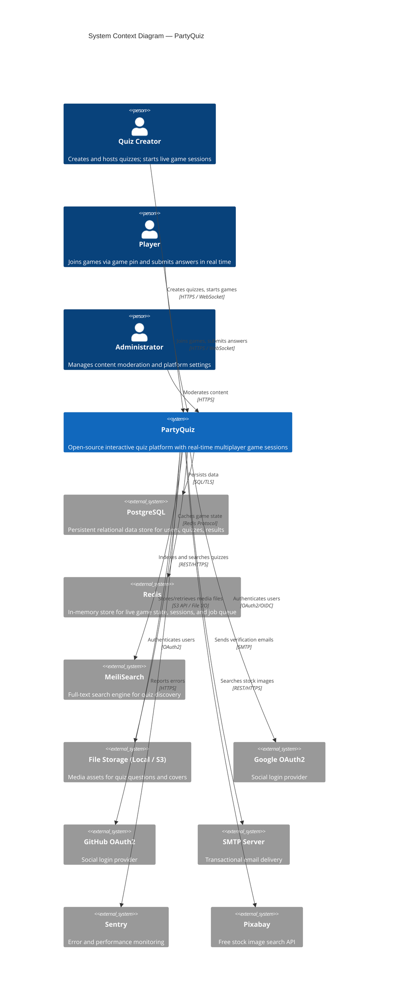
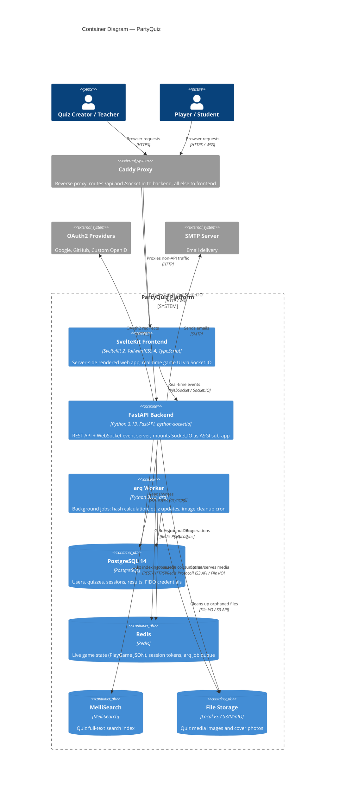

# Codebase Context

> **Phase:** Pre-0 — Reconnaissance
> **Agent:** The Scout
> **Status:** Approved
> **Created:** 2026-02-24
> **Approval date:** 2026-02-24
> **Approved by:** Jo Otey

---

## Project Overview

| Attribute | Detail |
|-----------|--------|
| **Project Name** | PartyQuiz (derived from ClassQuiz by mawoka-myblock) |
| **Primary Language(s)** | Python 3.13 (backend), TypeScript / Svelte (frontend) |
| **Framework(s)** | FastAPI + python-socketio (backend), SvelteKit 2 (frontend) |
| **Build System** | pip / Pipfile (backend), pnpm + Vite (frontend), Docker Compose (deployment) |
| **Package Manager(s)** | pip / pipenv (backend), pnpm (frontend) |
| **Runtime** | Python 3.13 (backend), Node.js (frontend SSR) |
| **Repository Age** | Active development; 25 Alembic migrations indicate iterative multi-month history |
| **Approximate Size** | ~60 Python source files, ~100+ Svelte/TS frontend files |

---

## Repository Structure

> **Note:** Files and directories created by the JumpStart installation process (`.jumpstart/`, `specs/`, `AGENTS.md`, `CLAUDE.md`, `.cursorrules`, `.github/copilot-instructions.md`, `.github/agents/`, `.github/prompts/`, `.github/instructions/`) are excluded from this analysis.

```
PartyQuiz-Dev/
├── classquiz/               # Backend Python package (all application logic)
│   ├── __init__.py          # FastAPI app factory & router registration
│   ├── auth.py              # JWT + argon2 auth, custom OAuth2 cookie scheme
│   ├── cache.py             # Redis-backed user lookup cache
│   ├── config.py            # Pydantic-settings configuration + service clients
│   ├── db/
│   │   ├── __init__.py      # SQLAlchemy metadata + databases async connection
│   │   ├── models.py        # All ormar ORM models + Pydantic game state models
│   │   └── quiztivity.py    # QuizTivity-specific data models
│   ├── emails/              # Jinja2 email templates + send utilities
│   ├── helpers/             # Misc utilities (avatar, box controller, hashcash, pixabay)
│   ├── kahoot_importer/     # Kahoot quiz import (search, get, transform)
│   ├── oauth/               # OAuth2 providers (Google, GitHub, custom OpenID Connect)
│   ├── routers/             # FastAPI APIRouter modules (one file = one feature area)
│   ├── socket_server/       # python-socketio async server (real-time game engine)
│   ├── storage/             # Pluggable storage abstraction (local / S3/MinIO)
│   ├── tests/               # pytest test suite
│   └── worker/              # arq background workers + cron jobs
├── frontend/                # SvelteKit frontend application
│   ├── src/
│   │   ├── routes/          # SvelteKit file-based routing (~20 top-level pages)
│   │   ├── lib/             # Shared components, stores, utilities, i18n
│   │   └── hooks.server.ts  # Server-side JWT validation + token refresh
│   └── static/              # Static assets
├── migrations/              # Alembic migration scripts (25 versions)
├── docker-compose.yml       # Production compose (api, frontend, db, redis, meilisearch, caddy)
├── docker-compose.dev.yml   # Development compose override
├── Dockerfile               # Backend container image
├── frontend/Dockerfile      # Frontend container image
├── Caddyfile                # Caddy reverse proxy config (production)
├── Caddyfile-docker         # Caddy config for Docker networking
├── Pipfile                  # Python dependencies
├── pyproject.toml           # Black formatter config
├── alembic.ini              # Alembic migration config
├── gunicorn_conf.py         # Gunicorn ASGI server config
├── prestart.sh              # DB migration runner (run at container startup)
├── start.sh                 # Container entrypoint script
├── simulate_players.py      # Dev utility: simulates concurrent game players
├── import_to_meili.py       # Utility: imports quizzes into MeiliSearch index
└── image_cleanup.py         # Utility: removes orphaned images
```

### Directory Purposes

| Directory | Purpose | Language(s) | Notable Files |
|-----------|---------|-------------|---------------|
| `classquiz/` | Entire backend application package | Python | `__init__.py` (app factory), `config.py` (settings) |
| `classquiz/routers/` | REST API endpoints, one module per feature | Python | `quiz.py`, `live.py`, `login.py`, `users/` |
| `classquiz/socket_server/` | Real-time game engine via Socket.IO | Python | `__init__.py` (all socket events), `session.py`, `helpers.py` |
| `classquiz/db/` | Database models and connection management | Python | `models.py` (all ORM + Pydantic models) |
| `classquiz/oauth/` | Third-party authentication providers | Python | `google.py`, `github.py`, `custom.py` |
| `classquiz/storage/` | File storage abstraction layer | Python | `local_storage.py`, `s3_storage.py` |
| `classquiz/worker/` | Background job processing | Python | `__init__.py` (WorkerSettings), `storage.py` |
| `classquiz/tests/` | Automated test suite | Python | `test_auth.py`, `test_server.py`, `test_storage.py` |
| `frontend/src/routes/` | SvelteKit page and layout components | Svelte/TS | `+layout.svelte`, `+page.svelte` per route |
| `frontend/src/lib/` | Shared UI components, utilities, stores | Svelte/TS | `socket.ts`, `stores.ts`, `stores.svelte.ts`, `i18n/` |
| `migrations/` | Alembic database migration history | Python | 25 versioned migration scripts |

---

## Technology Stack

| Category | Technology | Version | Role | Notes |
|----------|-----------|---------|------|-------|
| **Language (BE)** | Python | 3.13 | Backend application language | |
| **Language (FE)** | TypeScript | ~5.x (inferred) | Frontend application language | |
| **Framework (BE)** | FastAPI | latest (unpinned) | HTTP API framework | |
| **Framework (FE)** | SvelteKit | ^2.47.3 | Frontend framework (SSR + SPA) | **In active redesign** |
| **Realtime** | python-socketio | latest | WebSocket game engine (backend) | ASGI mounted on FastAPI |
| **Realtime (FE)** | socket.io-client | latest | WebSocket client | |
| **ORM** | ormar | latest | Async ORM + Pydantic integration | ⚠️ Deprecated/unmaintained |
| **DB Migrations** | Alembic | latest | Schema version control | 25 migrations |
| **Database** | PostgreSQL | 14 (Docker image) | Primary relational data store | |
| **Cache / Game State** | Redis | alpine (Docker) | Session cache + live game state | Game data stored as JSON |
| **Search** | MeiliSearch | latest | Full-text quiz search | |
| **Background Jobs** | arq | latest | Async job queue (Redis-backed) | |
| **CSS** | TailwindCSS | ^4 (PostCSS plugin) | Utility-first styling | v4 (config-file-free) |
| **Build Tool (FE)** | Vite | latest | Frontend build + dev server | |
| **Reverse Proxy** | Caddy | alpine | HTTPS termination, routing | |
| **Auth (hashing)** | argon2-cffi | latest | Password hashing | |
| **Auth (tokens)** | python-jose | latest | JWT encode/decode | |
| **Auth (OAuth)** | authlib | latest | OAuth2/OIDC client | Google, GitHub, custom |
| **Auth (WebAuthn)** | webauthn | ^1.x (pinned) | FIDO2 / passkeys | Only pinned dep |
| **Auth (2FA)** | pyotp | latest | TOTP 2FA | |
| **Storage (S3)** | minio | latest | S3-compatible object storage client | |
| **Error tracking** | sentry-sdk | latest | Error monitoring | |
| **Analytics** | Plausible | (external) | Privacy-friendly analytics | |
| **i18n** | i18next | ^25.6.0 | Frontend internationalization | Weblate-integrated |
| **Rich Editor** | CKEditor5 | ^47.1.0 | Quiz question rich text editor | |
| **File Upload** | Uppy | ^4.x | File upload UI | Dashboard + drag-drop |
| **Media (FE)** | @ffmpeg/ffmpeg | ^0.12.15 | In-browser video processing (WASM) | |
| **Forms** | felte + yup | ^1.x | Form management + validation | |
| **Testing (BE)** | pytest + pytest-asyncio | latest | Backend test runner | |
| **Testing (Coverage)** | coverage | latest | Code coverage | Reported to Codecov |
| **Linting (BE)** | flake8 | latest | Python linting | |
| **Formatting (BE)** | black | latest | Python code formatting | 120 char line length |
| **CI/CD** | GitHub Actions | — | Build, lint, test pipelines | 6 workflow files |
| **Containerization** | Docker + Docker Compose | — | Dev and production deployment | |

---

## Dependencies

### Backend Production Dependencies (Pipfile)

| Package | Category | Role |
|---------|----------|------|
| `fastapi` | Framework | HTTP API framework |
| `uvicorn` | Runtime | ASGI server |
| `gunicorn` | Runtime | Process manager for production |
| `python-socketio` | Realtime | WebSocket event server |
| `ormar` | ORM | Async ORM with Pydantic v2 integration |
| `asyncpg` | Database | Async PostgreSQL driver |
| `psycopg2` | Database | Sync Postgres driver (Alembic) |
| `alembic` | Migrations | Schema migration manager |
| `redis` | Cache | Async + sync Redis client |
| `arq` | Jobs | Redis-backed async job queue |
| `pydantic` + `pydantic-settings` | Validation | Data validation and settings management |
| `python-jose` | Auth | JWT encode/decode |
| `passlib` + `argon2-cffi` | Auth | Password hashing |
| `authlib` | Auth | OAuth2/OIDC provider integration |
| `webauthn==1.*` | Auth | WebAuthn (FIDO2) — **only pinned dep** |
| `pyotp` | Auth | TOTP 2FA |
| `cryptography` + `pyopenssl` | Auth | Cryptographic primitives |
| `itsdangerous` | Auth | Cookie/token signing |
| `meilisearch` | Search | MeiliSearch client |
| `minio` | Storage | S3/MinIO object storage client |
| `aiohttp` + `httpx` | HTTP | Async HTTP clients |
| `jinja2` | Templates | Email template rendering |
| `email-validator` | Validation | Email format validation |
| `python-multipart` | Files | Multipart form data parsing |
| `sentry-sdk` | Observability | Error tracking |
| `aiofiles` | Files | Async file I/O |
| `bleach` | Security | HTML sanitization |
| `qrcode` + `pypng` | Features | QR code generation |
| `xlsxwriter` + `openpyxl` | Features | Excel export/import |
| `py-avataaars-no-png` | Features | SVG avatar generation |
| `bidict` | Utility | Bidirectional dictionary |
| `xxhash` | Utility | Fast non-cryptographic hashing |
| `thumbhash-python` | Features | Image blur placeholder generation |
| `python-magic` | Files | MIME type detection |
| `starlette` | Framework | ASGI foundations (FastAPI dependency) |

### Backend Development Dependencies

| Package | Category | Role |
|---------|----------|------|
| `pytest` + `pytest-asyncio` | Testing | Async test runner |
| `pytest-dependency` + `pytest-order` | Testing | Test ordering and dependency management |
| `coverage` | Testing | Coverage measurement |
| `flake8` | Linting | PEP8 code style checking |
| `black` | Formatting | Code formatter |
| `pre-commit` | Tooling | Git hook manager |
| `python-socketio[client]` | Testing | Socket.IO client for integration tests |

### Dependency Observations

- **`ormar` is deprecated/no longer actively maintained.** This is the most significant dependency risk. Transitioning to SQLAlchemy 2.0 async or SQLModel would be preferred.
- Almost all Python dependencies use `"*"` (unpinned) except `webauthn = "==1.*"`. This means a `pip install` could silently introduce breaking changes.
- `@sentry/tracing` in the frontend is pinned to `^7.120.4` while `@sentry/browser` is `^10.x` — the tracing package is from the legacy Sentry SDK major version. These should be unified.
- Frontend dependencies are comprehensive and current (SvelteKit 2, TailwindCSS 4, etc.).
- `@ffmpeg/ffmpeg` (WASM) is a heavy build-time dependency for potential in-browser video features.

---

## External Integrations

| System / Service | Type | Protocol | Purpose | Configuration |
|-----------------|------|----------|---------|---------------|
| PostgreSQL | Database | TCP/SQL | Primary persistent data store | `DB_URL` env var |
| Redis | Cache + Queue | TCP | Session cache, live game state, arq job queue | `REDIS` env var |
| MeiliSearch | Search Engine | REST/HTTPS | Full-text quiz search index | `MEILISEARCH_URL`, `MEILISEARCH_INDEX` env vars |
| S3 / MinIO | Object Storage | S3 API | Quiz media file storage (optional) | `S3_*` env vars |
| Local Filesystem | Object Storage | File I/O | Quiz media file storage (default) | `STORAGE_PATH` env var |
| Google OAuth2 | Auth Provider | OAuth2/OIDC | Social login | `GOOGLE_CLIENT_ID/SECRET` env vars |
| GitHub OAuth2 | Auth Provider | OAuth2 | Social login | `GITHUB_CLIENT_ID/SECRET` env vars |
| Custom OpenID | Auth Provider | OIDC | Self-hosted SSO | `CUSTOM_OPENID_PROVIDER__*` env vars |
| hCaptcha | Bot Protection | REST/HTTPS | Registration captcha (optional) | `HCAPTCHA_KEY` env var |
| reCAPTCHA | Bot Protection | REST/HTTPS | Alternative captcha (optional) | `RECAPTCHA_KEY` env var |
| Pixabay | Image Search | REST/HTTPS | Free image search for quiz questions | `PIXABAY_API_KEY` env var |
| Sentry | Observability | HTTPS | Error tracking + performance monitoring | `SENTRY_DSN` env var |
| Plausible | Analytics | JS snippet | Privacy-friendly page analytics | `VITE_PLAUSIBLE_DATA_URL` env var |
| Mapbox | Maps | JS SDK | Geographic visualizations | (frontend, key in env) |
| SMTP | Email | SMTP | Account verification, password reset | `MAIL_*` env vars |
| Caddy | Reverse Proxy | HTTP/HTTPS | TLS termination, routing frontend ↔ API | `Caddyfile` |
| Weblate | i18n | External | Translation management | Hosted Weblate |

---

## C4 Architecture Diagrams

### System Context (Level 1)



The system serves three primary human actors (quiz creators, players, admins) and integrates with PostgreSQL for persistence, Redis for ephemeral game state, MeiliSearch for discovery, pluggable file storage, multiple OAuth providers, and observability/external APIs.

---

### Container Diagram (Level 2)



The Caddy reverse proxy routes traffic to the SvelteKit frontend (SSR) and the FastAPI backend. The backend serves both REST endpoints (`/api/v1/*`) and the Socket.IO WebSocket server. A separate arq worker process handles background and scheduled tasks. All three backend processes share the same PostgreSQL, Redis, MeiliSearch, and file storage infrastructure.

---

## Code Patterns and Conventions

### File Organization

| Pattern | Convention | Example |
|---------|-----------|---------|
| **File naming (BE)** | snake_case | `test_auth.py`, `local_storage.py` |
| **File naming (FE)** | kebab-case for components, SvelteKit conventions for routes | `navbar.svelte`, `+page.svelte` |
| **Directory structure (BE)** | Layer-based (routers, models, helpers, oauth, storage, worker) | `classquiz/routers/quiz.py` |
| **Directory structure (FE)** | Feature-based via SvelteKit file routing + `lib/` for shared | `src/routes/play/`, `src/lib/play/` |
| **Test location** | Separate tree under `classquiz/tests/` | `classquiz/tests/test_auth.py` |
| **Config files** | Root-level `.env` (runtime), `pyproject.toml` (tooling), `alembic.ini` | `.env` |

### Coding Patterns

| Pattern | Approach | Notes |
|---------|----------|-------|
| **Error handling (BE)** | FastAPI `HTTPException` raises in routers; no result types | Inconsistent — some routes return `JSONResponse` directly |
| **Async model (BE)** | `async/await` throughout | FastAPI + asyncpg + redis async |
| **Dependency Injection (BE)** | FastAPI `Depends()` for auth user injection | `get_current_user` pattern |
| **Logging (BE)** | Python `logging` module via `uvicorn` logger | Minimal structured logging |
| **Input validation (BE)** | Pydantic models (via ormar + direct BaseModel) | Field validators on QuizQuestion |
| **State management (FE)** | Svelte stores (`stores.ts`) + Svelte 5 Runes (`stores.svelte.ts`) | **Mid-migration**: both patterns coexist |
| **Auth (BE)** | JWT in HTTP-only cookies + rememberme token middleware | Slide-in refresh via `hooks.server.ts` |
| **Game State** | Redis JSON blobs (not in PostgreSQL) | `PlayGame`, `GamePlayer` Pydantic models serialized to Redis |
| **SPDX headers** | All source files have SPDX license/copyright headers | MPL-2.0 |

### Testing Patterns

| Aspect | Convention |
|--------|-----------|
| **Test framework** | pytest + pytest-asyncio (strict asyncio mode) |
| **Test naming** | `test_<thing>` function naming |
| **Mocking approach** | Minimal mocking; tests hit real services (integration-style) |
| **Test data** | Inline fixtures; `pytest-order` for sequenced flows |
| **Test command** | `coverage run -m pytest --lf -v --asyncio-mode=strict classquiz/tests` |
| **Coverage reporting** | Codecov integration via GitHub Actions |
| **Test areas** | `test_auth.py`, `test_server.py`, `test_storage.py`, Kahoot importer tests |

---

## Existing Documentation

| Document | Location | Status | Notes |
|----------|----------|--------|-------|
| README | [README.md](../README.md) | Current | Good overview; references original ClassQuiz; self-hosting and dev links |
| Socket.IO events | [SocketIo.md](../SocketIo.md) | Present | Documents socket event protocol |
| CQA file format | [classquiz/routers/cqa-file-format.md](../classquiz/routers/cqa-file-format.md) | Present | Custom quiz export format spec |
| Kahoot importer | [classquiz/kahoot_importer/README.md](../classquiz/kahoot_importer/README.md) | Present | Kahoot integration docs |
| Contributing guide | [CONTRIBUTING.md](../CONTRIBUTING.md) | Present | Exists |
| Migration intent | [migration_to_rust.md](../migration_to_rust.md) | Stub | File exists but is nearly empty — placeholder only |
| Live Redis data | [live_redis_data.md](../live_redis_data.md) | Present | Documents Redis key schema for live games |
| API docs | `/api/docs` (FastAPI auto-generated) | Auto-generated | Swagger UI at runtime |

---

## Technical Debt and Observations

> **Note:** These are observations, not recommendations. The Scout documents what exists without prescribing changes.

### Structural Observations

- All database models (`User`, `Quiz`, `PlayGame`, `GameSession`, etc.) live in a single file (`classquiz/db/models.py` — 569 lines). This file is dense and mixes ormar ORM models with pure Pydantic game-state models.
- `classquiz/routers/users/` is a subdirectory (feature expansion) while other routers are flat files — inconsistent nesting.
- `classquiz/socket_server/__init__.py` is 467 lines containing all socket event handlers — no internal module decomposition.
- Frontend `src/lib/` contains both page-level components and generic utilities without strict sub-categorization.

### Code Quality Observations

- **Svelte 5 migration in progress**: `stores.ts` (legacy Svelte 4 stores) coexists with `stores.svelte.ts` (Svelte 5 Runes syntax). The layout uses both `pathname` from the legacy store and `navbarVisible` from the Runes store in the same file.
- Commented-out validation code found in `classquiz/routers/live.py` — the `answers_not_none_if_abcd_type` validator in `_PlayGame` is fully commented out, meaning live game answers receive no type-level validation.
- `app.on_event("startup")` / `app.on_event("shutdown")` in `classquiz/__init__.py` are deprecated in FastAPI since v0.95. The `lifespan` async context manager pattern is preferred.
- `default=uuid.uuid4()` (evaluated at class-definition time, not per-instance) is used in several ormar models — this is a known ormar behavior that can cause UUID collisions if objects are created without explicit IDs.
- The socket server creates a Fernet key by SHA-256 hashing the `secret_key` and taking the first 32 bytes as Latin-1 — this is an unusual key derivation approach.
- `MAX_WORKERS: "1"` is hard-documented as non-changeable in `docker-compose.yml`, suggesting the socket server has in-process state that doesn't survive multi-process operation.

### Test Coverage Observations

- Tests cover auth, core server endpoints, storage, and Kahoot importer.
- No visible end-to-end or browser tests.
- Live game (socket server) appears to have no dedicated automated tests — the most complex part of the system.
- `simulate_players.py` exists as a manual load simulation tool, not an automated test.

### Security Observations

- Passwords hashed with argon2 (strong choice).
- JWTs stored in HTTP-only cookies — good; prevents XSS token theft.
- `bleach` used for HTML sanitization (user-provided quiz content).
- `hCaptcha` / `reCAPTCHA` support for registration (both optional).
- `webauthn` (FIDO2 / passkeys) support implemented.
- TOTP 2FA implemented via `pyotp`.
- Backup codes stored as hex in user record.
- `SECRET_KEY: "TOP_SECRET"` default value in `docker-compose.yml` — relies on operator to change before production deployment.
- All source files carry SPDX license and copyright headers (REUSE compliant).

### TODO/FIXME/HACK Comments

| File | Context | Comment | Category |
|------|---------|---------|----------|
| `classquiz/routers/live.py` | `_PlayGame` validator | Entire validator body commented out (`# return v` only) | FIXME |
| `docker-compose.yml` | `MAX_WORKERS` | `"1" # Very important and DON'T CHANGE` | NOTE |
| `migration_to_rust.md` | Project root | Placeholder stub — no content beyond title | TODO |

---

## Key Files Reference

| File | Purpose | Importance |
|------|---------|------------|
| [classquiz/\_\_init\_\_.py](../classquiz/__init__.py) | FastAPI app factory; mounts all routers and socket server | Critical |
| [classquiz/db/models.py](../classquiz/db/models.py) | All ORM models (User, Quiz) + Pydantic game state models | Critical |
| [classquiz/config.py](../classquiz/config.py) | Pydantic-settings config; creates Redis, MeiliSearch, and storage clients | Critical |
| [classquiz/socket_server/\_\_init\_\_.py](../classquiz/socket_server/__init__.py) | Entire real-time game engine; all socket event handlers | Critical |
| [classquiz/auth.py](../classquiz/auth.py) | JWT auth, argon2 hashing, cookie-based OAuth2 scheme | Critical |
| [classquiz/routers/live.py](../classquiz/routers/live.py) | REST endpoints for live game coordination | High |
| [classquiz/routers/quiz.py](../classquiz/routers/quiz.py) | Quiz CRUD, play start, Kahoot import bridge | High |
| [frontend/src/hooks.server.ts](../frontend/src/hooks.server.ts) | SvelteKit server hook: JWT decode + token refresh | High |
| [frontend/src/routes/+layout.svelte](../frontend/src/routes/+layout.svelte) | Root layout: theming, i18n init, navbar visibility | High |
| [frontend/src/lib/socket.ts](../frontend/src/lib/socket.ts) | Socket.IO client instance (shared singleton) | High |
| [docker-compose.yml](../docker-compose.yml) | Full production infrastructure definition | High |
| [migrations/versions/](../migrations/versions/) | 25 Alembic migration scripts (schema history) | Medium |
| [classquiz/worker/\_\_init\_\_.py](../classquiz/worker/__init__.py) | Background worker definitions and cron schedule | Medium |
| [live_redis_data.md](../live_redis_data.md) | Redis key schema documentation for live games | Medium |

---

## Insights Reference

**Companion Document:** [specs/insights/codebase-context-insights.md](insights/codebase-context-insights.md)

Key insights surfaced during reconnaissance:

1. **Svelte 4 → 5 migration in progress** - Both `stores.ts` and `stores.svelte.ts` coexist; the frontend redesign is creating an inconsistent state while the migration proceeds.
2. **`ormar` deprecation is the top dependency risk** - The ORM underpinning all database access is no longer maintained; this affects every data layer operation.
3. **Real-time game state is fully Redis-ephemeral** - `PlayGame` and all live session data live only in Redis, not PostgreSQL; this is intentional but means game state is lost on Redis restart unless AOF/RDB persistence is enabled.
4. **Socket server cannot be multi-process** - `MAX_WORKERS=1` is documented as mandatory; the socket server holds in-memory state and is not horizontally scalable in the current design.
5. **The live game answer validation is disabled** - The Pydantic validator in `_PlayGame` is commented out, meaning submitted answers in live games bypass answer type checking.

See the insights document for complete observations and rationale.

---

## Phase Gate Approval

- [x] Repository structure has been mapped and annotated
- [x] Dependencies have been cataloged with categories and versions
- [x] C4 diagrams have been generated at configured levels
- [x] Code patterns and conventions have been documented
- [x] The human has reviewed and approved this document

**Approved by:** Jo Otey
**Approval date:** 2026-02-24
**Status:** Approved
